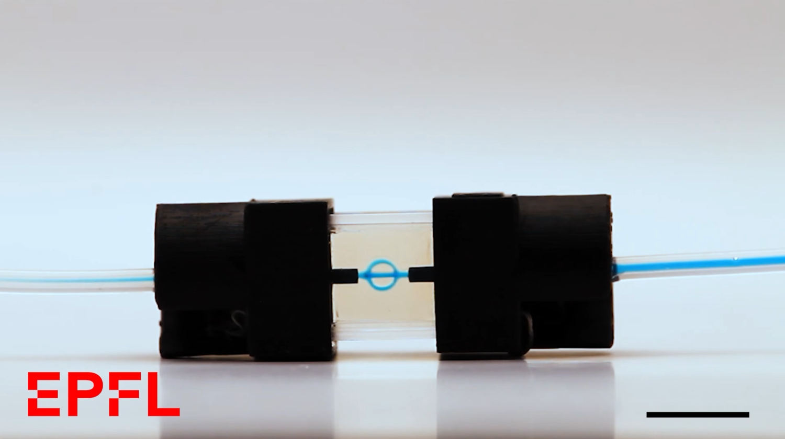

# Overprinting with Tomographic Volumetric Additive Manufacturing

This is the supplementary code and configuration files for the following paper:

```bibtex
XXX

```

<a  href="https://www.youtube.com/watch?v=ePuIFgeUbNk"></a>


# Dr.TVAM
We used [Dr.TVAM](github.com/rgl-epfl/drtvam) (version 0.3.0) to optimize those configuration files.

For example, the patterns for the perfusion system can be optimized by calling:
```
drtvam spheres_bio_channels/config.json
```


# License
The following configuration files are compatible with [drtvam](https://github.com/rgl-epfl/drtvam) and are only allowed to use for academic, non-commercial purposes only. See [LICENSE](LICENSE) for more details.
