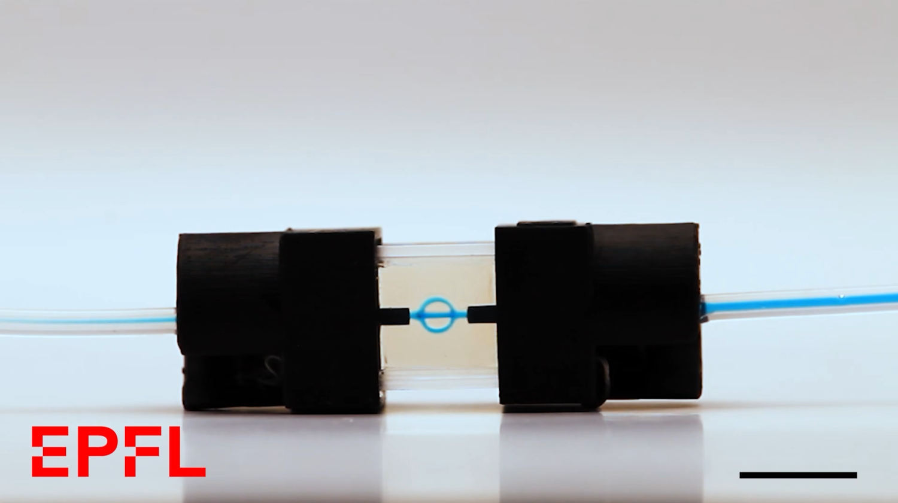

# Overprinting with Tomographic Volumetric Additive Manufacturing

This is the supplementary code and configuration files for the following [pre-print](https://arxiv.org/abs/2507.13842):

```bibtex
@article{Wechsler_Sgarminato_Rizzo_Nicolet_Jakob_Moser_2025, title={Overprinting with tomographic volumetric additive manufacturing},
   rights={2026 The Author(s)},
   ISSN={2041-1723},
   url={https://www.nature.com/articles/s41467-026-73477-3},
   DOI={10.1038/s41467-026-73477-3},
   journal={Nature Communications},
   publisher={Nature Publishing Group},
   author={Wechsler, Felix and Sgarminato, Viola and Rizzo, Riccardo and Nicolet, Baptiste and Jakob, Wenzel and Moser, Christophe},
   year={2026},
   month=jun,
   language={en}
}
```

<a  href="https://www.youtube.com/watch?v=ePuIFgeUbNk"></a>


# Dr.TVAM
We used [Dr.TVAM](https://github.com/rgl-epfl/drtvam) (version 0.7.0) to optimize those configuration files.

For example, the patterns for the perfusion system can be optimized by calling:
```
# install drtvam first
pip install drtvam==0.6.0

# optimize patterns
drtvam spheres_bio_channels/config.json
```

# arXiv version
This repository might change in future but the state of the arXiv preprint can be found [here](https://github.com/EPFL-LAPD/Overprinting-with-Tomographic-Volumetric-Additive-Manufacturing/releases/tag/arXiv2507.13842).


# License
The following configuration files are compatible with [Dr.TVAM](https://github.com/rgl-epfl/drtvam) and are only allowed to use for academic, non-commercial purposes only. See [LICENSE](LICENSE) for more details.
